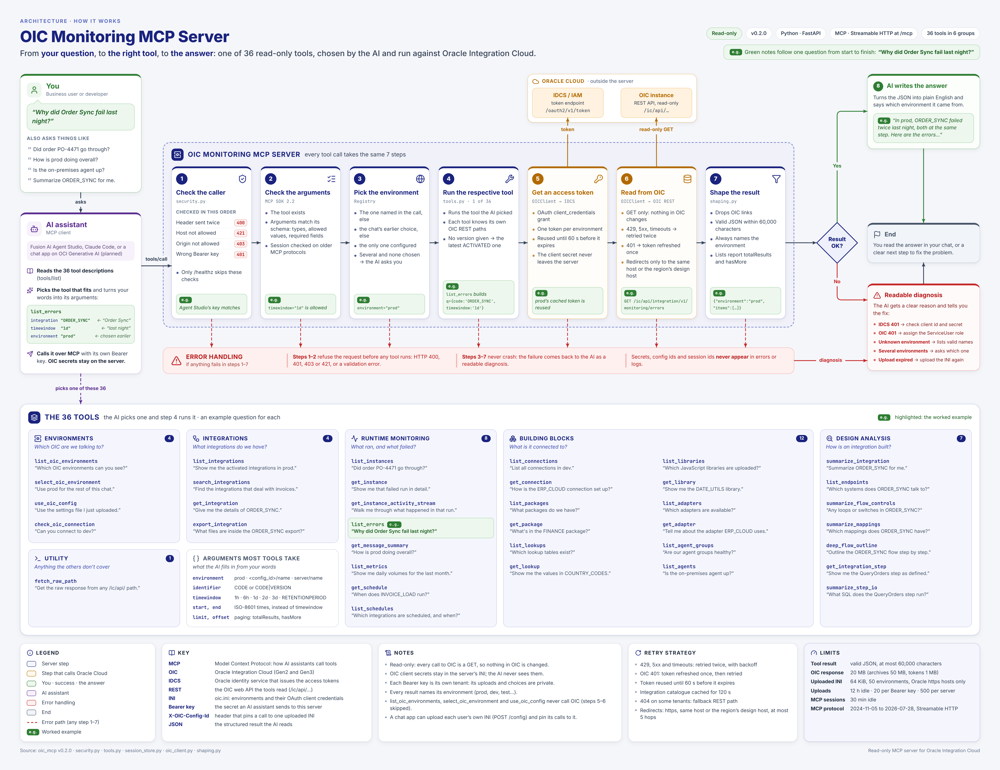

# OIC Monitoring MCP Server (Streamable HTTP, multi-environment)

A read-only [MCP](https://modelcontextprotocol.io) server for Oracle Integration Cloud. Ask an agent about
integrations, runtime instances, errors, schedules, connections and flow design in plain language, across
several OIC environments, from Fusion AI Agent Studio, Claude, VS Code or your own chat backend.

This is a refactor of [`mkc110891/oic-monitoring-mcp`](https://github.com/mkc110891/oic-monitoring-mcp)
(MIT). Nothing in it changes OIC: every call is a GET.



## What changed from upstream

| Area | Upstream | Now |
|---|---|---|
| Transport | WebSocket only (not an MCP standard transport) | **Streamable HTTP** at `/mcp` via the official MCP Python SDK v2: protocol 2024-11-05 up to 2026-07-28, JSON responses |
| Environments | One OIC instance per process (`.env`) | **Many per process** from an INI file; per-call `environment`, session selection, or per-user uploads |
| Inbound auth | None | Bearer tokens (constant-time check); each token is a tenant boundary; Origin and optional Host allowlists; refuses unsafe startup |
| `fetch_raw_path` | Could send the OIC token to `<oic-host>.attacker.tld` | Locked to `/ic/api/…` on the configured host (encoded `..` refused too) |
| Redirects | Bearer forwarded to any host | Only the same host or the same region's `design.integration.*` host |
| `designJsonPath` | Read any JSON file on the server | Removed |
| Catalogue paging | `page=` (not an OIC parameter) | `offset`/`limit`, stops safely if the server ignores it |
| "Latest version" | First version the list returned | Highest **activated** version, else highest; result says which |
| Failures | 401 became "not found" or an empty list | Raised with a diagnosis (bad secret, missing ServiceUser role, wrong URL) |
| Design analysis | Steps inside arrays were invisible | Walker fixed |
| Protocol | Errors on `notifications/initialized` and `ping`, one request at a time, no input validation | Handled by the SDK: concurrent, schema-validated |
| Output | Cut at 100k chars mid-JSON | Always valid JSON; lists trimmed with a `truncated` note; OIC `links` stripped |
| Startup | `cp .env.example .env` crashed (`MCP_LOG_FILE`) | Unknown env keys ignored |
| Also | No retries (`HTTP_MAX_RETRIES` unused) | Retries 429/5xx/timeouts; `activityStreamDetails` (was deprecated `activityStream`); dates normalised to OIC's UTC format; search by business ID; concurrent schedule/agent scans; non-root Docker image |

## Quick start (local)

```bash
git clone https://github.com/ashisshaw001/oic-mcp-server.git && cd oic-mcp-server
python3 -m venv .venv && . .venv/bin/activate      # Windows: py -3 -m venv .venv; .\.venv\Scripts\Activate.ps1
pip install -r requirements.txt
cp .env.example .env            # set MCP_AUTH_TOKENS
cp oic.ini.example oic.ini      # fill in your environments
python -m oic_mcp               # or scripts/run-local.sh / scripts\run-local.ps1
curl http://127.0.0.1:8085/healthz
```

Generate a token with `python -c "import secrets; print(secrets.token_urlsafe(32))"`. For loopback-only
experiments you can set `MCP_AUTH_DISABLED=true` instead; the server refuses it on any other address.

## Configure OIC environments

`oic.ini`: one section per environment. The section name is what people and the model call it.

```ini
[DEFAULT]
token_url = https://idcs-xxxx.identity.oraclecloud.com/oauth2/v1/token

[prod]
url = https://myoic-prod-abcdefgh-ph.integration.us-phoenix-1.ocp.oraclecloud.com
client_id = ...
client_secret = ...

[dev]
url = https://myoic-dev-abcdefgh-ph.integration.us-phoenix-1.ocp.oraclecloud.com
client_id = ...
client_secret = ...
```

* Required: `url`, `client_id`, `client_secret`, `token_url`. Optional: `scope`, `instance_name`.
* `instance_name` is OIC's `integrationInstance` (About page > Service instance). It is derived from Gen3
  instance URLs automatically; set it when `url` is the shared `design.integration.*` host.
* Comments must be on their own line. Inline `;`/`#` are kept as part of the value so secrets are never truncated.
* Parse errors report line numbers only, never line contents.

### Three ways to supply configs

| Source | How | Good for |
|---|---|---|
| Server-side | `OIC_CONFIG_FILE=/config/oic.ini` | Agent Studio and shared deployments |
| Upload | `POST /config` (INI as the raw body, Bearer required) returns `config_id` | Per-user configs from your chat UI/backend |
| Header | `X-OIC-Config-Id: <config_id>` on MCP requests | Your backend pins the config: a hard scope (nothing else is reachable) and results show bare names, so the model never sees the id |

Uploads live **in memory only**, expire after `OIC_UPLOAD_TTL_SECS` of idleness, and can be revoked with
`DELETE /config/{config_id}`. Credentials are never returned, logged or written to disk. An upload belongs to
the Bearer token that sent it: other tokens cannot see, use, delete or evict it (quotas are per token).
Uploaded hosts must match `OIC_UPLOAD_ALLOWED_HOST_SUFFIXES` (default `.ocp.oraclecloud.com,.identity.oraclecloud.com`),
and an upload may hold at most 50 environments.

```bash
curl -X POST http://127.0.0.1:8085/config -H "Authorization: Bearer $TOKEN" \
     -H "Content-Type: text/plain" --data-binary @oic.ini
```

### How a call picks its environment

1. The tool's `environment` argument: `prod`, `<config_id>/prod` for an uploaded config, or `server/prod` to
   reach the server's config from a session that has an upload attached. (With the header, only the pinned
   config's names work.)
2. The session's selection (`select_oic_environment`), if the client has an MCP session.
3. The only environment, if there is exactly one.
4. Otherwise the call fails with the list, and the model asks the user.

Clients on the 2026-07-28 protocol (and servers with `MCP_STATELESS=true`) have **no session**, so a selection
cannot be remembered. `select_oic_environment` says so, and the model passes `environment` on each call.
(An `Mcp-Session-Id` header on such requests is ignored: the SDK only validates it on older-protocol requests,
so trusting it would let one caller ride another's session.) Every result includes `"environment"` so answers
can always say where the data came from.

## Connect a client

**Fusion AI Agent Studio:** add an MCP server with URL `https://<your-host>/mcp` and header
`Authorization: Bearer <token>`. Use a server-side `OIC_CONFIG_FILE`.

**Claude Code:**

```bash
claude mcp add --transport http oic http://127.0.0.1:8085/mcp --header "Authorization: Bearer <token>"
```

On Windows PowerShell, avoid quoting issues with a project `.mcp.json` (copy `mcp.json.example`; it reads
`OIC_MCP_TOKEN` from your environment).

**VS Code** (`.vscode/mcp.json`):

```json
{
  "servers": { "oic": { "type": "http", "url": "http://127.0.0.1:8085/mcp",
                         "headers": { "Authorization": "Bearer ${input:oicToken}" } } },
  "inputs": [ { "type": "promptString", "id": "oicToken", "description": "OIC MCP token", "password": true } ]
}
```

**Browser-based clients** (e.g. MCP Inspector) send an `Origin` header: add it to `MCP_ALLOWED_ORIGINS`.

## Tools (36)

All accept an optional `environment`. Integrations are `CODE` or `CODE|VERSION`; without a version the highest
activated version is used.

* **Environments:** `list_oic_environments`, `select_oic_environment`, `use_oic_config`, `check_oic_connection`
* **Integrations:** `list_integrations`, `search_integrations`, `get_integration`, `export_integration`
* **Runtime:** `list_instances` (filter by integration, status, window, dates, `business_id`), `get_instance`,
  `get_instance_activity_stream`, `list_errors` (+ `error_text`, `recoverable`), `get_message_summary`,
  `list_metrics`, `get_schedule`, `list_schedules`
* **Building blocks:** `list_connections`, `get_connection`, `list_packages`, `get_package`, `list_lookups`,
  `get_lookup`, `list_libraries`, `get_library`, `list_adapters`, `get_adapter`, `list_agent_groups`, `list_agents`
* **Design analysis:** `summarize_integration` (+ `step_names`), `list_endpoints`, `summarize_flow_controls`,
  `summarize_mappings`, `deep_flow_outline`, `get_integration_step`, `summarize_step_io`
* **Utility:** `fetch_raw_path` (GET under `/ic/api/` on the environment's own host)

The parameter is called `environment`, not `instance`, because in OIC an instance is a runtime execution.

### Mapping from the 41 upstream tools

| Upstream | Now |
|---|---|
| `list_integrations`, `list_integrations_simple`, `list_activated_integrations` | `list_integrations` (`status=ACTIVATED`) |
| `list_all_integrations`, `list_integrations_comprehensive`, `search_integrations_by_pattern`, `search_integration_by_name`, `list_integrations_search` | `search_integrations` (empty query lists all) |
| `get_integration`, `get_integration_simple`, `get_integration_auto` | `get_integration` |
| `get_connection`, `get_connection_detail` | `get_connection` |
| `summarize_integration`, `summarize_integration_with_steps` | `summarize_integration` |
| `search_json` | removed: it made the model send data back in, costing as many tokens as the data |
| everything else | same name |

## Deploy

```bash
docker build -t oic-mcp .
docker run -d --name oic-mcp --restart unless-stopped -p 8080:8080 \
  -e MCP_AUTH_TOKENS=<token> -e OIC_CONFIG_FILE=/config/oic.ini \
  -v $PWD/oic.ini:/config/oic.ini:ro oic-mcp
```

* Put TLS in front (OCI Load Balancer, API Gateway, nginx). Set `MCP_ALLOWED_HOSTS` to your public hostname
  (`/healthz` is exempt so probes with internal Host headers still work).
* Give each tenant/backend its own Bearer token. Callers sharing a token share uploads and can use each other's
  session ids, which is why the server keeps session ids out of its logs. Requests repeating `Authorization`,
  `Host`, `Mcp-Session-Id` or `X-OIC-Config-Id` are rejected, so every layer sees the same value.
* **More than one replica:** sessions are in memory. Either route on the `Mcp-Session-Id` header (sticky), or
  set `MCP_STATELESS=true` and rely on the per-call `environment`. Uploaded configs are per-replica too, so with
  uploads use sticky routing or a single replica.
* The container runs as a non-root user and exposes `GET /healthz` for probes.
* Grant each OIC confidential app only the `ServiceUser` role.

## Troubleshooting

| Symptom | Cause / fix |
|---|---|
| Tool says "IDCS rejected the client credentials" | Wrong `client_id`/`client_secret`/`token_url`. |
| Tool says "OIC rejected the access token … ServiceUser" | Token is fine; assign your confidential app to the **OIC instance's resource app** → Application roles → `ServiceUser`. `check_oic_connection` confirms. |
| 404/400 with a Gen3 hint | Set `instance_name` in the INI. |
| HTTP 401 from the server | Missing/wrong `Authorization: Bearer` header. |
| HTTP 403 | The request carried an `Origin` not in `MCP_ALLOWED_ORIGINS`. |
| HTTP 421 | `Host` not in `MCP_ALLOWED_HOSTS`, or auth is disabled and the host isn't localhost. |
| "Several OIC environments are configured" | Expected: pass `environment`, or `select_oic_environment` on session clients. |
| "refusing to forward credentials" | OIC redirected somewhere other than the same host or the region's design host; if legitimate, add its suffix to `OIC_REDIRECT_ALLOWED_SUFFIXES`. |
| Upload rejected: "host is not allowed" | Uploaded hosts must match `OIC_UPLOAD_ALLOWED_HOST_SUFFIXES` (custom domains: add yours). |

## Develop

```bash
pip install -r requirements-dev.txt
pytest -q          # unit tests + end-to-end over real HTTP against a fake OIC
```

The end-to-end tests drive the server with the MCP SDK's own client in both protocol eras (legacy session and
2026-07-28), including uploads, header configs, auth, and failure diagnoses.

## License

MIT; see `LICENSE` (upstream copyright retained).
